# Video-DPO: Temporal Consistency Alignment for Video Diffusion

<p align="center">
  
  
  
  
</p>

<p align="center">
  <b>Align video diffusion models for temporally consistent generation using Direct Preference Optimization</b>
</p>

<p align="center">
  
  
  
</p>

---

## Results

### Quantitative Improvements

Our DPO-aligned model achieves significant improvements in temporal consistency metrics:

| Metric | Base Model | DPO Model | Improvement |
|:------:|:----------:|:---------:|:-----------:|
| **Warping Error** ↓ | 150.32 | 111.62 | **-25.7%** |
| **Frame Difference** ↓ | 7.20 | 5.88 | **-18.3%** |

> *Lower values indicate better temporal consistency. Evaluated on 47 diverse video samples.*

### Training Dynamics

<p align="center">
  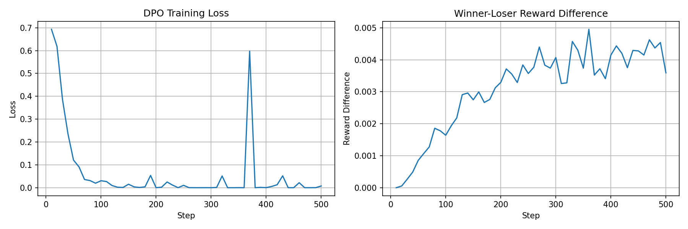
</p>

The training curves demonstrate:
- **Left**: DPO loss converging from ~0.7 to near 0, indicating successful preference learning
- **Right**: Reward difference (winner - loser) increasing over training, showing the model learns to distinguish temporally consistent videos

### Visual Comparisons

#### Base Model vs DPO-Aligned Model

<table>
<tr>
<th>Base Model (Before)</th>
<th>DPO Model (After)</th>
</tr>
<tr>
<td>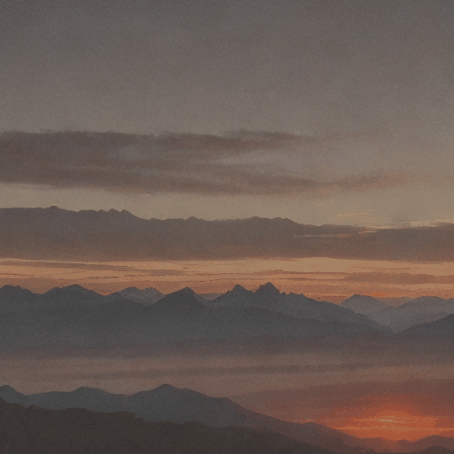</td>
<td>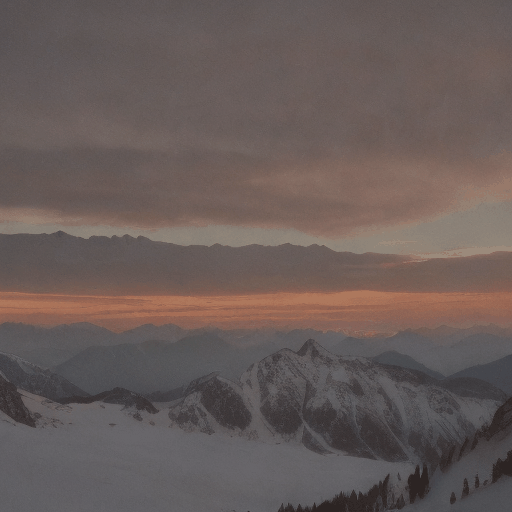</td>
</tr>
<tr>
<td>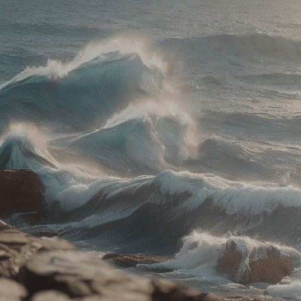</td>
<td>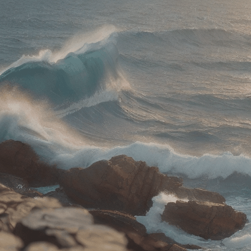</td>
</tr>
<tr>
<td>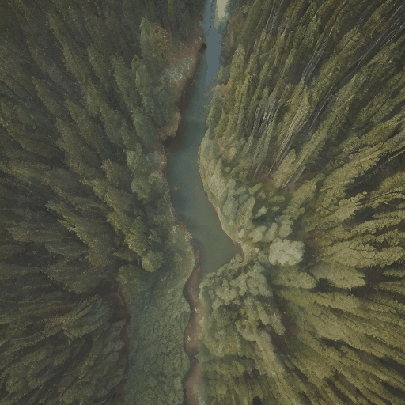</td>
<td>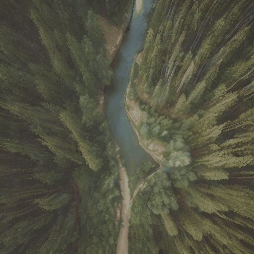</td>
</tr>
<tr>
<td>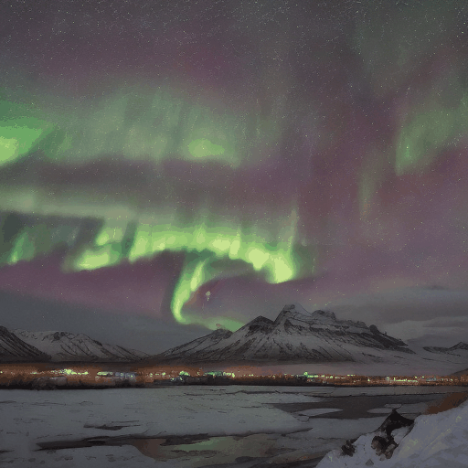</td>
<td>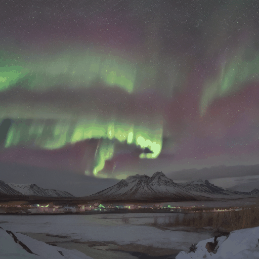</td>
</tr>
</table>

> *The DPO-aligned model produces smoother frame transitions with reduced flickering artifacts.*

#### Training Data: Winner vs Loser Examples

<table>
<tr>
<th>Winner (Temporally Consistent)</th>
<th>Loser (Temporally Jittery)</th>
</tr>
<tr>
<td>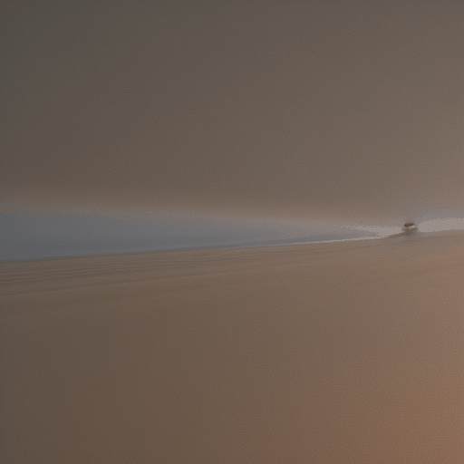</td>
<td>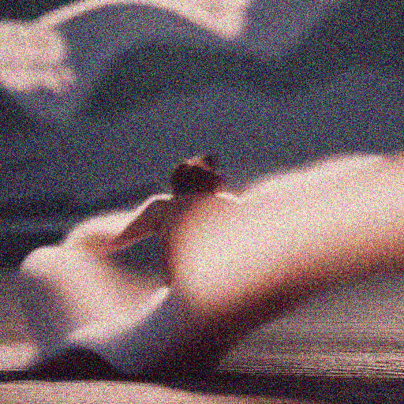</td>
</tr>
</table>

> *The model learns to prefer smooth temporal transitions (left) over jittery artifacts (right).*

<details>
<summary><b>View More Comparison Results (47 pairs available)</b></summary>

All comparison results are available in the `results/comparison_results/` folder:
- `comparison_X_base.gif` - Base model output
- `comparison_X_dpo.gif` - DPO-aligned model output

</details>

---

## Overview

**Video-DPO** applies [Diffusion-DPO](https://arxiv.org/abs/2311.12908) to video generation, specifically targeting **temporal consistency** in AnimateDiff models. By training on synthetic preference pairs (smooth vs. jittery videos), we align the motion modules to produce more coherent frame-to-frame transitions.

### Key Features

- **Memory-Optimized Training**: Novel adapter toggling technique reduces GPU memory by ~50%
- **Flexible Data Generation**: Two jitter methods (noise injection / img2img) with configurable strength
- **Multi-Prompt Training**: Diverse prompts for better generalization across content types
- **GPU-Specific Configs**: Pre-tuned configurations for T4, L4, and A100 GPUs
- **LoRA Fine-tuning**: Efficient training targeting only motion module attention layers
- **Optical Flow Evaluation**: Quantitative metrics for temporal consistency measurement

---

## How It Works

### The DPO Framework for Video

Direct Preference Optimization learns from preference pairs without explicit reward modeling:

```
L_DPO = -log σ(β · (r_winner - r_loser))
```

Where the implicit reward is computed as:
```
r = MSE(ref_prediction, noise) - MSE(policy_prediction, noise)
```

### Preference Pair Generation

| Winner (Temporally Consistent) | Loser (Temporally Jittery) |
|:------------------------------:|:--------------------------:|
| Standard AnimateDiff generation | Same content + temporal noise |
| Smooth frame transitions | Per-frame color/noise shifts |
| Coherent motion | Flickering artifacts |

**Two Jitter Methods:**

1. **Noise Injection** (Fast): Direct per-frame noise + color shift
   ```python
   frame_noise = randn_like(frame) * jitter_strength
   color_shift = (rand(3,1,1) - 0.5) * jitter_strength * 0.5
   ```

2. **Img2Img** (Higher Quality): Per-frame regeneration with unique seeds
   - Preserves semantic content
   - Breaks temporal consistency through independent denoising

### Architecture

```
┌─────────────────────────────────────────────────────────────┐
│                    AnimateDiff Pipeline                      │
├─────────────────────────────────────────────────────────────┤
│  ┌─────────────┐    ┌─────────────┐    ┌─────────────┐     │
│  │   Text      │    │    UNet     │    │    VAE      │     │
│  │  Encoder    │───▶│  + Motion   │───▶│  Decoder    │     │
│  │             │    │   Modules   │    │             │     │
│  └─────────────┘    └──────┬──────┘    └─────────────┘     │
│                            │                                │
│                    ┌───────▼───────┐                       │
│                    │  LoRA Layers  │ ◀── Training Target   │
│                    │  (to_q/k/v)   │                       │
│                    └───────────────┘                       │
└─────────────────────────────────────────────────────────────┘
```

**Training Target**: Only `motion_modules` attention projections (`to_q`, `to_k`, `to_v`, `to_out.0`)

---

## Installation

### Prerequisites

- Python 3.9+
- CUDA 11.8+ (for GPU training)
- 16GB+ GPU VRAM (T4 minimum, A100 recommended)

### Setup

```bash
# Clone the repository
git clone https://github.com/YOUR_USERNAME/Video-DPO.git
cd Video-DPO

# Install dependencies
make install

# Or manually:
pip install torch>=2.1.0 torchvision torchaudio --index-url https://download.pytorch.org/whl/cu121
pip install diffusers>=0.26.0 transformers accelerate peft safetensors
pip install pyyaml tqdm einops imageio[ffmpeg] pillow opencv-python>=4.8.0 scipy
```

---

## Quick Start

### 1. Generate Training Data

```bash
# Generate preference pairs (winner/loser videos encoded to latents)
make data

# Or with custom config:
python scripts/generate_data.py --config configs/train_config.yaml
```

### 2. Train the Model

```bash
# Start DPO training
make train

# Or with GPU-specific config:
python scripts/train.py --config configs/train_t4.yaml   # For T4 (16GB)
python scripts/train.py --config configs/train_l4.yaml   # For L4 (24GB)
python scripts/train.py --config configs/train_a100.yaml # For A100 (40GB+)
```

### 3. Generate Comparison Videos

```bash
# Generate side-by-side comparison (base vs DPO-aligned)
make inference

# Or manually:
python scripts/inference.py --config configs/train_config.yaml --checkpoint checkpoints/latest
```

### 4. Evaluate Results

```bash
# Run optical flow evaluation
python scripts/evaluate.py --config configs/train_config.yaml \
    --checkpoint checkpoints/latest \
    --num_samples 20
```

---

## Configuration

### Data Generation Options

```yaml
data:
  num_pairs: 200          # Number of preference pairs
  num_frames: 16          # Frames per video
  resolution: 512         # Video resolution
  jitter_strength: 0.15   # Jitter intensity (0.1-0.3 recommended)
  jitter_method: "noise"  # "noise" (fast) or "img2img" (quality)

  # Multiple prompts for diversity
  prompts:
    - "cinematic shot, smooth motion, high quality"
    - "drone footage flying over mountains"
    - "ocean waves crashing on beach"
```

### Model Options

```yaml
model:
  base_model: "emilianJR/epiCRealism"
  motion_adapter: "guoyww/animatediff-motion-adapter-v1-5-2"
  lora_rank: 16           # LoRA rank (4-32)
  lora_alpha: 32          # LoRA alpha (typically 2x rank)
```

### Training Options

```yaml
training:
  batch_size: 1
  gradient_accumulation_steps: 4
  learning_rate: 1.0e-5
  max_train_steps: 1000
  beta: 2500              # DPO temperature
  mixed_precision: "fp16"
  memory_optimized: true  # Enable for GPUs <40GB
```

---

## GPU Configuration Guide

| GPU | VRAM | Config | Data Pairs | Frames | Resolution | LoRA Rank | Steps |
|-----|------|--------|------------|--------|------------|-----------|-------|
| T4 | 16GB | `train_t4.yaml` | 10 | 8 | 256 | 4 | 50 |
| L4 | 24GB | `train_l4.yaml` | 50 | 16 | 512 | 16 | 200 |
| A100 | 40GB+ | `train_a100.yaml` | 200 | 16 | 512 | 32 | 500 |

### Memory Optimization

Enable `memory_optimized: true` in config to use **adapter toggling** instead of maintaining a separate reference model:

- **Standard Mode**: Deep-copies UNet for reference (~8GB extra)
- **Memory-Optimized**: Toggles LoRA adapters on/off (~0GB extra)

```yaml
training:
  memory_optimized: true  # Saves ~50% GPU memory
```

---

## Project Structure

```
Video-DPO/
├── configs/
│   ├── train_config.yaml      # Default training config
│   ├── train_t4.yaml          # T4 GPU (16GB) optimized
│   ├── train_l4.yaml          # L4 GPU (24GB) optimized
│   ├── train_a100.yaml        # A100 GPU (40GB+) optimized
│   └── test_config.yaml       # Quick validation config
├── scripts/
│   ├── generate_data.py       # Preference pair generation
│   ├── train.py               # DPO training script
│   ├── inference.py           # Video generation comparison
│   ├── evaluate.py            # Optical flow evaluation
│   └── validate_data.py       # Data validation utility
├── src/
│   ├── model.py               # Model wrapper with LoRA injection
│   ├── trainer.py             # DPO trainer implementation
│   ├── dataset.py             # PyTorch dataset for latent pairs
│   ├── config_parser.py       # YAML config loader
│   └── utils.py               # Utilities (seeding, logging, device)
├── Makefile                   # Convenience commands
└── requirements.txt           # Dependencies
```

---

## Evaluation Metrics

The evaluation script computes two metrics for temporal consistency:

### 1. Warping Error (Optical Flow)
- Computes flow between consecutive frames
- Warps frame_t to predict frame_{t+1}
- Measures MSE between prediction and actual
- **Lower = better temporal consistency**

### 2. Frame Difference
- Average absolute difference between consecutive frames
- Measures raw flickering intensity
- **Lower = smoother transitions**

```bash
# Actual evaluation results from our training:
==================================================
SUMMARY
==================================================

Metric               Base            DPO             Change
------------------------------------------------------------
Warping Error        150.32          111.62          -25.7%
Frame Difference     7.20            5.88            -18.3%

Note: Lower values indicate better temporal consistency.
```

---

## Training Tips

1. **Start Small**: Use `test_config.yaml` to validate pipeline before full training
2. **Monitor Rewards**: `reward_w > reward_l` indicates learning is working
3. **Adjust Beta**: Higher beta (3000-5000) = sharper preference, lower (1000-2000) = smoother
4. **Diverse Prompts**: Use 8+ diverse prompts for better generalization
5. **Jitter Strength**: 0.10-0.20 for subtle improvement, 0.20-0.30 for aggressive training

---

## Troubleshooting

### Out of Memory (OOM)

```yaml
# Enable memory optimization
training:
  memory_optimized: true
  gradient_accumulation_steps: 8  # Increase if still OOM

# Reduce data dimensions
data:
  num_frames: 8
  resolution: 256
```

### Training Loss Not Decreasing

- Increase `beta` (DPO temperature)
- Increase `jitter_strength` for clearer preference signal
- Check that LoRA is targeting motion modules (logs should show "motion_modules" in trainable params)

### Generated Videos Look Same as Base

- Train for more steps
- Increase `lora_rank` for more capacity
- Ensure checkpoint is loading correctly in inference

---

## References

- [Diffusion-DPO Paper](https://arxiv.org/abs/2311.12908) - Wallace et al., 2023
- [AnimateDiff](https://github.com/guoyww/AnimateDiff) - Guo et al., 2023
- [PEFT/LoRA](https://github.com/huggingface/peft) - Hu et al., 2021

---

## License

This project is licensed under the MIT License - see the [LICENSE](LICENSE) file for details.

---

## Citation

If you find this work useful, please consider citing:

```bibtex
@software{video_dpo,
  title={Video-DPO: Temporal Consistency Alignment for Video Diffusion},
  author={},
  year={2024},
  url={https://github.com/YOUR_USERNAME/Video-DPO}
}
```

---

<p align="center">
  <i>Built with PyTorch, Diffusers, and PEFT</i>
</p>
